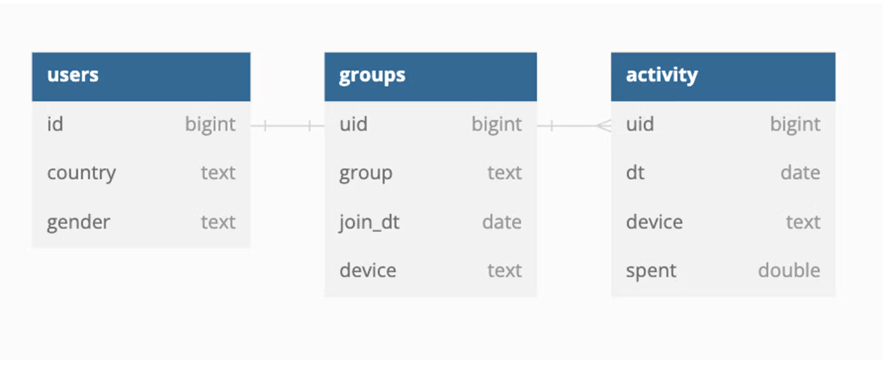

# Globox

Welcome! This repository contains all of the code, notebooks, images and other materials related to the A/B testing (Globox).

## Context
Specializing in sourcing unique and high-quality products from around the world, Globox is an online marketplace that offers a diverse range of items to its customers. Their motto, captured in their logo, is " We believe that shopping should be an adventure, and we want to bring the world to your doorstep. From exotic spices and rare teas to handmade jewellery and textiles, we have a curated selection of products that you won't find anywhere else”.

## The A/B test is set up as follows:
• Theexperimentisexclusivelyconductedonthemobilewebsite.

• When a user visits the GloBox main page, they are randomly
assigned to either the control or treatment group.
• Theuser'sjoindateisrecorded.

• If the user is assigned to the treatment group, the page loads the
banner. If assigned to the control group, the banner is not loaded.

• Subsequently, the user may or may not make purchases on the website. This purchase can occur on the same day they join the
experiment or days later.

• Anypurchasemadebytheuserisconsidereda"conversion".

## A/B Test Analysis:
The project included an A/B test to measure the impact of a new
feature on Globox's platform. The test utilized two metrics: conversion rate and average user spending.

